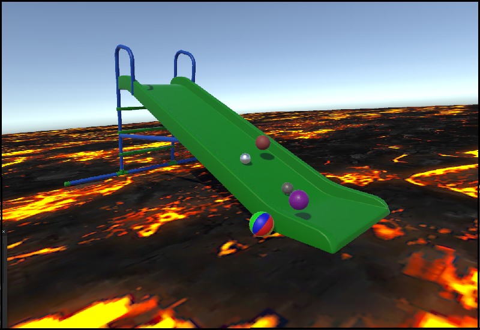
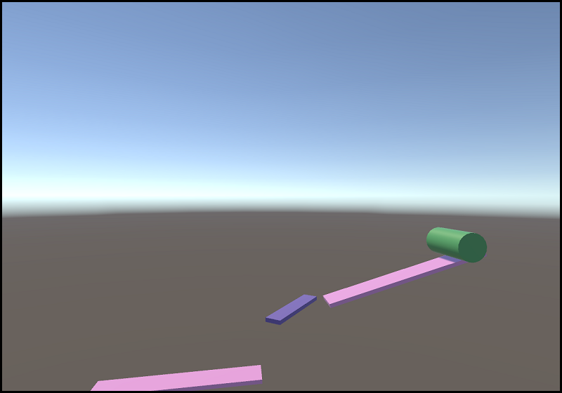
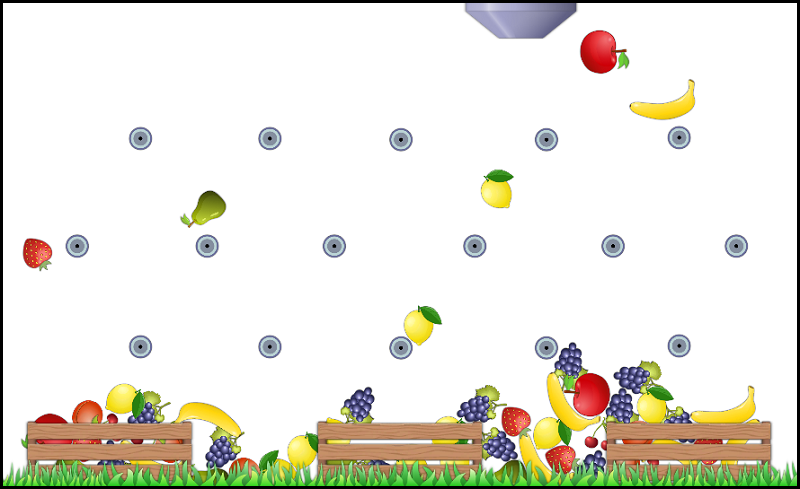
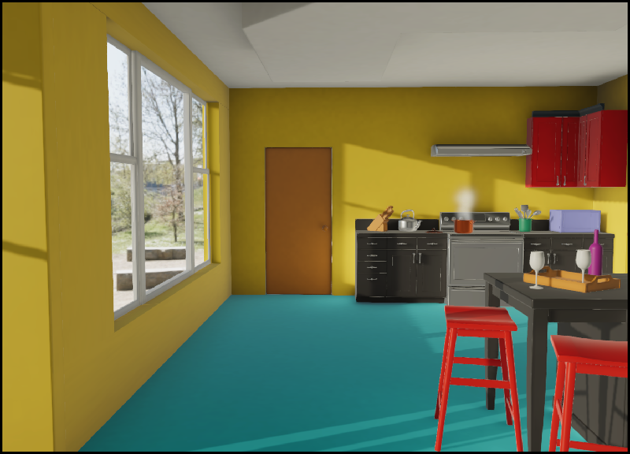

# unity-essentials-challenges

## Challenge 1

### Project Objective

#### Explore the 3D capabilities and features of Unity

* Create a new 3D project.
* Create 3D objects in the Unity Editor.
* Move, scale, and rotate objects in 3D space.
* Control the properties and behaviors of 3D objects using components.
* Create and apply a material to a 3D object.
* Adjust the Directional Light in a 3D Scene.
* Manage GameObjects with prefabs, prefab variants, and nested prefabs
* Find and import 3D assets from the Unity Asset Store.
* Publish a 3D project.

  

## Challenge 2

### Project Objective

####  Customize the ways GameObjects behave

* Create a new script component 
* Understand the purpose of the default code generated within a newly created C# script 
* Print a message to the Unity Editor console using a simple script
* Change a GameObject using a simple script 
* Explain the relationship between scripts and components 

  

## Challenge 3

### Project Objective

#### Create a pachinko-style interaction using Sprites

* Create a new 2D Scene.
* Create new Sprites.
* Navigate in 2D space in the Scene view.
* Move, rotate, and scale Sprites.
* Move and rotate the Main Camera.
* Add a RigidBody 2D Component to Sprites.
* Add a Collider Component to Sprites.
* Playtest a game in the Game view.

  

## Challenge 4

Used "Foundations of Audio" asset of Unity Technologies under Standard Unity Asset Store EULA 

### Project Objective

#### Explore and experiment with audio in Unity

* Define the role of an Audio Source, an Audio Clip, and an Audio Listener in a Scene.
* Implement audio that appears to come from a particular point in 3D space (e.g. localized sound effects) and audio that appears to come from no place in particular (e.g. background music).
* Configure the rolloff of an Audio Source in order to control how its volume changes with distance (e.g. logarithmic, linear, or custom).
* Programmatically play, pause, and stop sounds from a script in order to control audio effects based on certain events. 
  
  

